# MQTT Distribution Services
Author: Dominik Viererbe

## Actors

### Event Bus
The *MQTT Broker* which is used as a *Event Bus* that distributes Events published by the other actors to the subscribed *MQTT Clients*.

### Tracker Server
Is a *MQTT Client* that manages the *Distribution Service*. It handles new *Torrent Servers* that want to join the *Distribution Service*, publishes new *File Infos* and distributes *Fragments* to the registered *Torrent Servers*.

### Torrent Server
Is a *MQTT Client*, to which *Fragments* can be distributed to and than stored by it and which monitors and stores changes in the distribution of the information.

## Concepts

### File Info
Information about an fragmented file. The information consists of the hash value of the file content, the size of the file content and the sequence of hash values of the fragments the file is fragmented into.

### Fragment
Is a part of the content of a file. Can be described as the hash value and the size of the content.

### Distribution View
World view of an actor how the fragments are distributed among the individual actors; including the metadata about the *Fragments* and Files (*File Infos*).

### Joining Client
Is a *Torrent Server* that tries to join the *Distribution Service*. If the client succeeds it becomes a *Registered Client*. 
No *Fragments* may be distributed to a *Joining Client*

### Registered Client
Is a *Torrent Server* that successfully joined the *Distribution Service*. A *Registered Client* is part of the *Distribution Service* to whom fragments may be distributed to.

### Endpoint
An *Endpoint* is a [*Uri*](https://en.wikipedia.org/wiki/Uniform_Resource_Identifier) where a User can request *Fragments* and their distribution via [*gRPC*](https://grpc.io/). (The details are not included in the scope of this documentation.)

## Use Cases

### Tracker Server Startup
#### Description
*Tracker Server* initializes and connects to the *Event Bus* to controll the *Distribution Service*.

#### Actors
* *Tracker Server*  
* *Event Bus*

#### Stakeholders
* *Tracker Server*  
* *Torrent Server*

#### Preconditions
* Event Bus (MQTT Broker) must already be running.
* No other *Tracker Server* is connected to the *Event Bus*.

#### Invariants
* No more than one *Tracker Server* is connected to the *Event Bus*.

#### Result
* *Tracker Server* is connected to the *Event Bus* and gets notified about all events which are relevant for the *Tracker Server* (*ClientJoinRequested*, *ClientJoinSucceeded*, *ClientJoinFailed*, *ClientGoodbye*, *FragmentDistributionRequested*, *FragmentDistributionObtained*, *FragmentDistributionFailed*)
* *Unregistered Clients* which were connected to the Event Bus before the *Tracker Server* connected are notified that the *Tracker Server* is online and they now can request to join the *Distribution Service*.
* *Torrent Server* can now request to join the *Distribution Service*

#### Standard Procedure
**1.** Connect to *Event Bus*  
**2.** Subscribe to events relevant for the *Tracker Server*  
    **2.1** Subscribe to `clients/join/requested` (*ClientJoinRequested* Event)  
    **2.2** Subscribe to `clients/join/succeeded` (*ClientJoinSucceeded* Event)  
    **2.3** Subscribe to `clients/join/failed` (*ClientJoinFailed* Event)  
    **2.4** Subscribe to `clients/goodbye` (*ClientGoodbye* Event)  
    **2.5** Subscribe to `fragments/distribution/requested` (*FragmentDistributionRequested* Event)  
    **2.6** Subscribe to `fragments/distribution/obtained` (*FragmentDistributionObtained* Event)  
    **2.7** Subscribe to `fragments/distribution/failed` (*FragmentDistributionFailed* Event)  
**3.** Publish *TrackerHello* Event

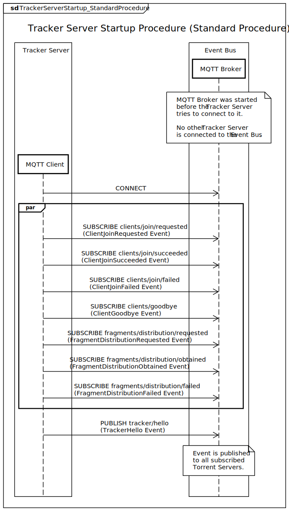

#### Alternative 1 (connecting to *Event Bus* fails)
**1a.** Connecting to *Event Bus* fails.  
**1a1.** Abort Procedure.

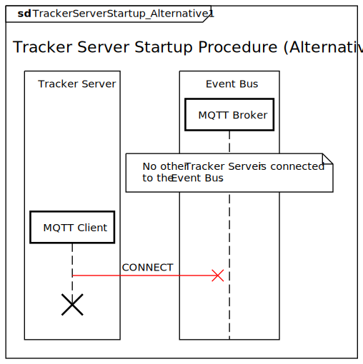

#### Alternative 2 (subscribing to any event fails)
**2a.** Subscribing to one or more events relevant for the *Tracker Server* fails.  
**2a1.** Disconnecting from *Event Bus*.  
**2a2.** Abort Procedure.

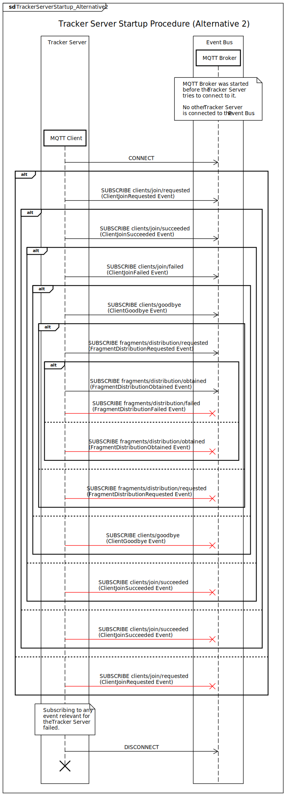

#### Alternative 3 (publishing *TrackerHello* Event fails)
**3a.** Publishing *TrackerHello* Event fails.  
**3a1.** Disconnecting from *Event Bus*.  
**3a2.** Abort Procedure.

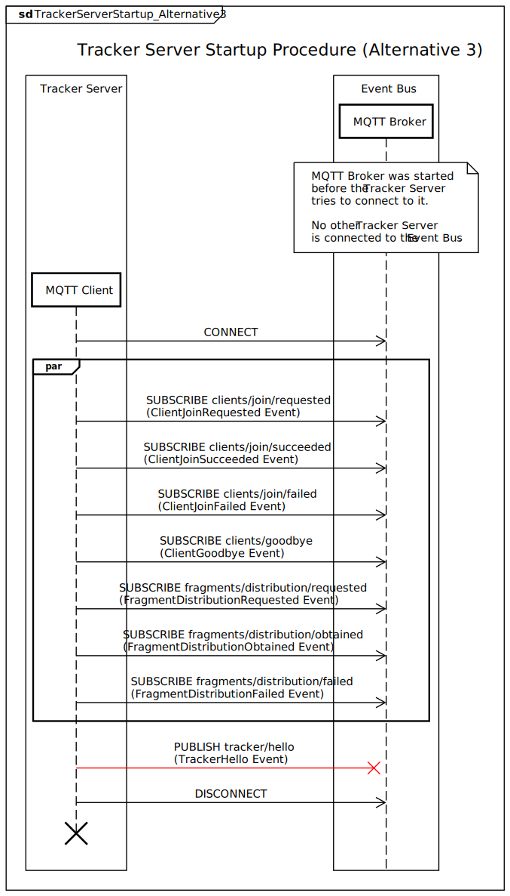

### Tracker Server Goodbye
#### Description
The *Tracker Server* disconnects from the *Distribution Service*.

#### Actors
*Tracker Server*
*Event Bus*
*Registered Clients*

#### Stakeholders
*Tracker Server*
*Registered Clients*

#### Preconditions
* *Tracker Server* Startup succeeded.  

#### Invariants

#### Result
* *Tracker Server* is disconnected from the *Distribution Service*.
* All *Registered Clients* in the *Distribution Service* are now unregistered.
* The *Registered Clients* are waiting for the next *TorrentHello* Event to register themselfs.

#### Standard Procedure
**1.** *Tracker Server* publishes a *TrackerGoodbye* Event to the *Event Bus*.  
**2.** The *Event Bus* publishes the *TrackerGoodbye* Event to the *Registered Clients*.  
**3** The *Tracker Server* disconnects from the *Event Bus*.  

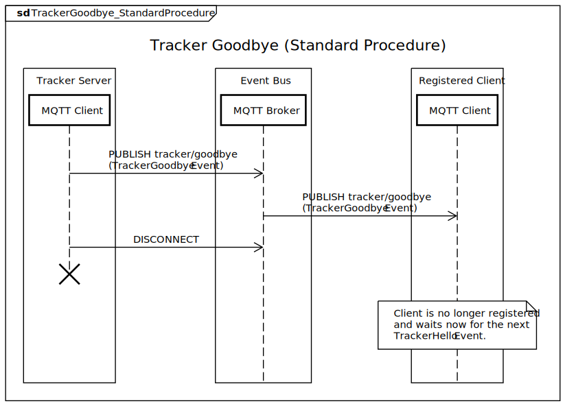

### Torrent Server Startup
#### Description
*Torrent Server* initializes and connects to the *Event Bus* to get a *Registered Client*.

#### Actors
* *Torrent Server*  
* *Event Bus*

#### Stakeholders
* *Tracker Server*  
* *Torrent Server*

#### Preconditions
* Event Bus (MQTT Broker) must already be running.

#### Invariants
* Event Bus (MQTT Broker) keeps running.

#### Result
* *Torrent Server* is connected to the *Event Bus* and gets notified about all events which are relevant for the *Torrent Server* (*TrackerHello*, *TrackerGoodbye*, *ClientJoinAccepted*, *ClientJoinDenied*, *ClientRegistered*, *ClientGoodbye*, *FileInfoPublished*, *FragmentDistributionStarted*, *FragmentDistributionDelivered*, *FragmentDistributionEnded*)

#### Standard Procedure
**1.** Connect to *Event Bus*  
**2.** Subscribe to events relevant for the *Tracker Server*  
    **2.1** Subscribe to `tracker/hello` (*TrackerHello* Event)  
    **2.2** Subscribe to `tracker/goodbye` (*TrackerGoodbye* Event)  
    **2.3** Subscribe to `clients/join/accepted` (*ClientJoinAccepted* Event)  
    **2.4** Subscribe to `clients/join/denied` (*ClientJoinDenied* Event)  
    **2.5** Subscribe to `clients/registered` (*ClientRegistered* Event)  
    **2.6** Subscribe to `clients/goodbye` (*ClientGoodbye* Event)  
    **2.7** Subscribe to `files/info` (*FileInfoPublished* Event)  
    **2.8** Subscribe to `fragments/distribution/started` (*FragmentDistributionStarted* Event)  
    **2.9** Subscribe to `fragments/distribution/delivered` (*FragmentDistributionDelivered* Event)  
    **2.10** Subscribe to `fragments/distribution/ended` (*FragmentDistributionEnded* Event)  
**3.** Try get *Registered Client*.

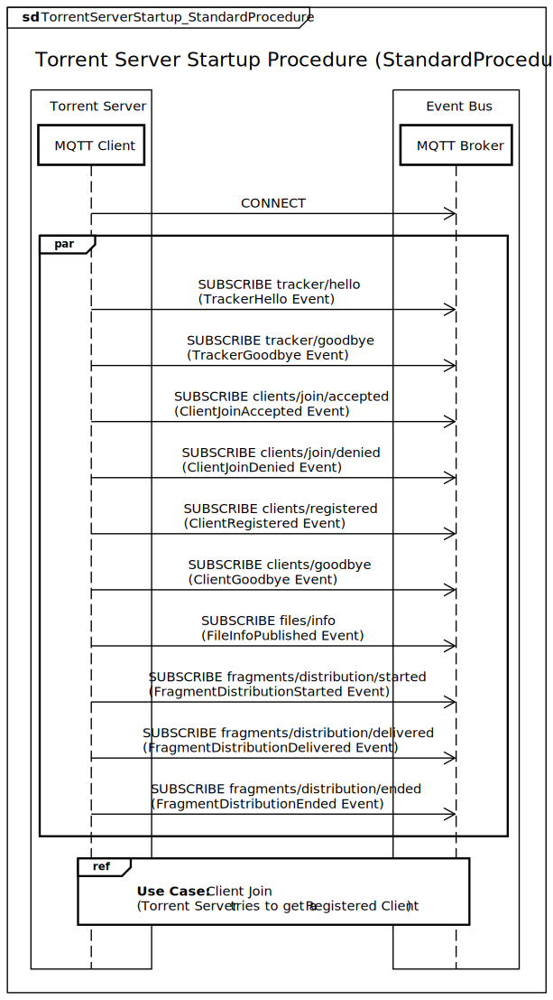

#### Alternative 1 (connecting to *Event Bus* fails)
**1a.** Connecting to *Event Bus* fails.  
**1a1.** Abort Procedure.

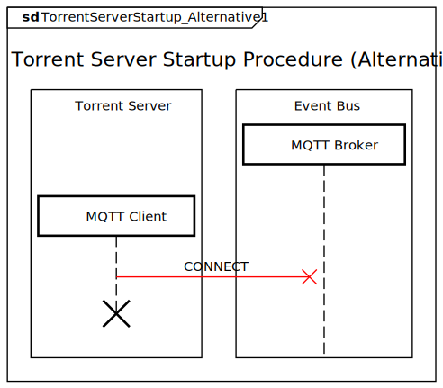

#### Alternative 2 (subscribing to any event fails)
**2a.** Subscribing to one or more events relevant for the *Torrent Server* fails.  
**2a1.** Disconnecting from *Event Bus*.  
**2a2.** Abort Procedure.

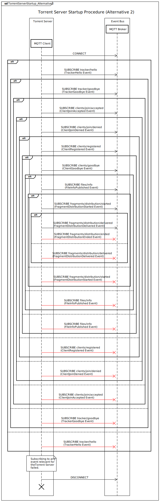

### Client Join
#### Description
A *Torrent Server* joins the *Distribution Service* to become a *Registered Client*.

#### Actors
* *Torrent Server*  
* *Event Bus*

#### Stakeholders
* *Tracker Server*  
* *Torrent Server*

#### Preconditions
* *Tracker Server* Startup succeeded. 

#### Invariants
* *Event Bus* is running.
* *Tracker Server* is connected.
* All participants of the *Distribution Service* share the same *Distribution View*.
* All participants of the *Distribution Service* use the same `FragmentSize`.

#### Result
* *Tracker Server* joins the *Distribution Service* and becomes a *Registered Client*.
* Newly *Registered Client* shares the same *Distribution View* as the other participants of the *Distribution Service*.
* Already existing *Registered Clients* added the ditribution metadata introduced by the newly *Registered Client* to their *Distribution View*.

#### Standard Procedure
**1.** The *Torrent Server* that wants to join the *Distribution Service* requests to join the *Distribution Service* by publishing a *ClientJoinRequested* Event to the *Event Bus*.  
**2.** The *Event Bus* publishes the Event to the *Tracker Server*.  
**3.** The *Tracker Server* checks for conflicts with the *Distribution View* when the *Torrent Server* would join the *Distribution Service*.  
**4.** When no conflicts were found, the *Tracker Server* calculates which metadata of the *Distribution View* the *Torrent Server* has to add to it's *Distribution View* to join the *Distribution Service*.  
**5.** The *Tracker Server* publishes a *ClientJoinAccepted* Event that contains the calculated data to the *Event Bus*.  
**6.** The *Event Bus* publishes this Event to all subscribed *Torrent Servers*.  
**7.** The *Torrent Server* that requested to join the *Distribution Service* changes it's *Distribution View* according to the parameters of the *ClientJoinAccepted* Event.  
**8.** The *Torrent Server* publishes a *ClientJoinSucceeded* Event to the *Event Bus* to notify the *Tracker Server* that the changes were done successfully.  
**9.** The *Event Bus* //TODO:

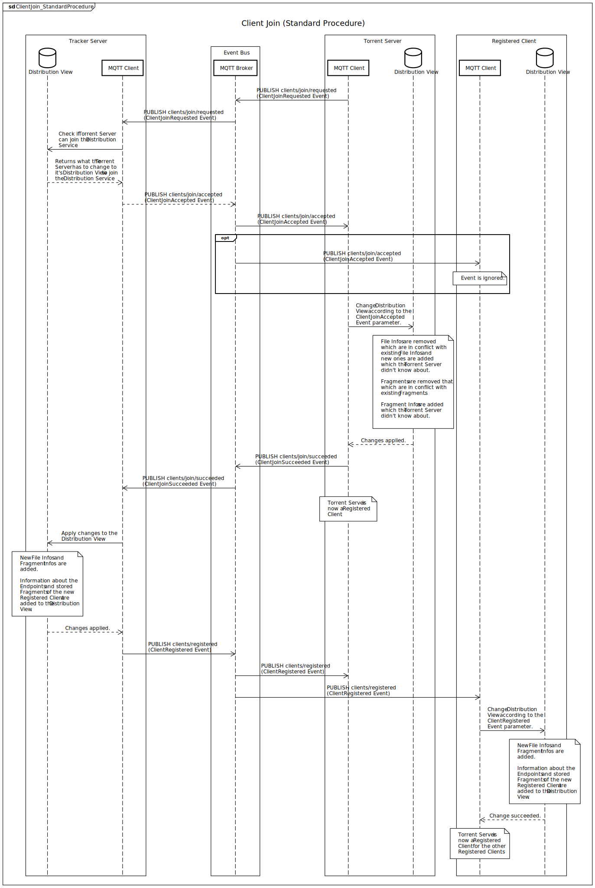

#### Alternative 1 ()
//TODO:

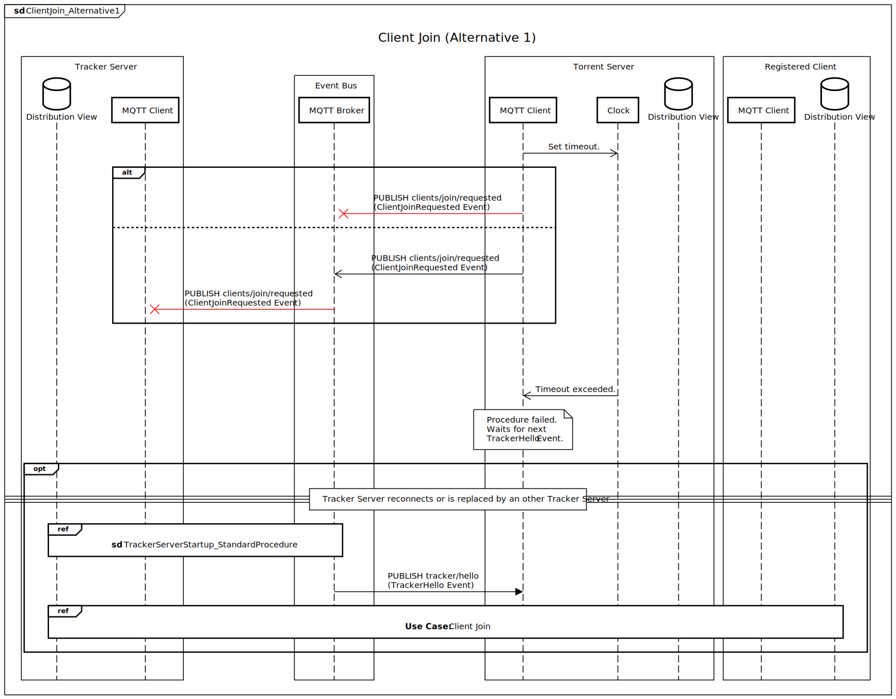

#### Alternative 2 ()
//TODO:

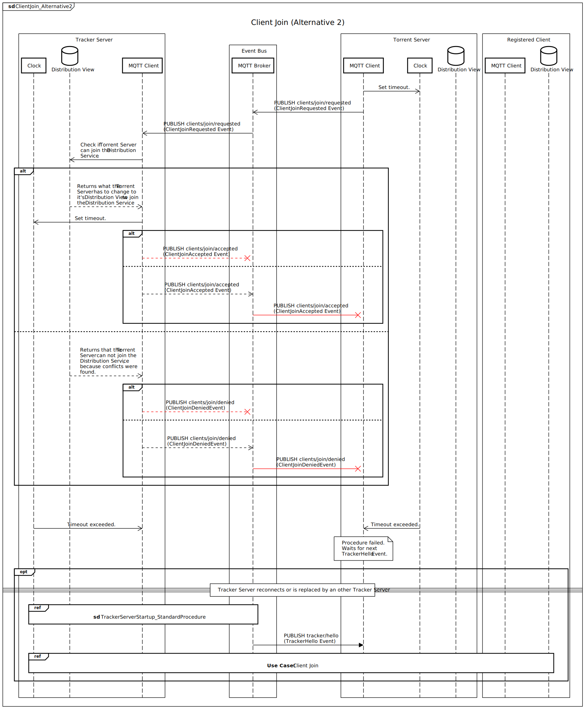

#### Alternative 3 ()
//TODO:

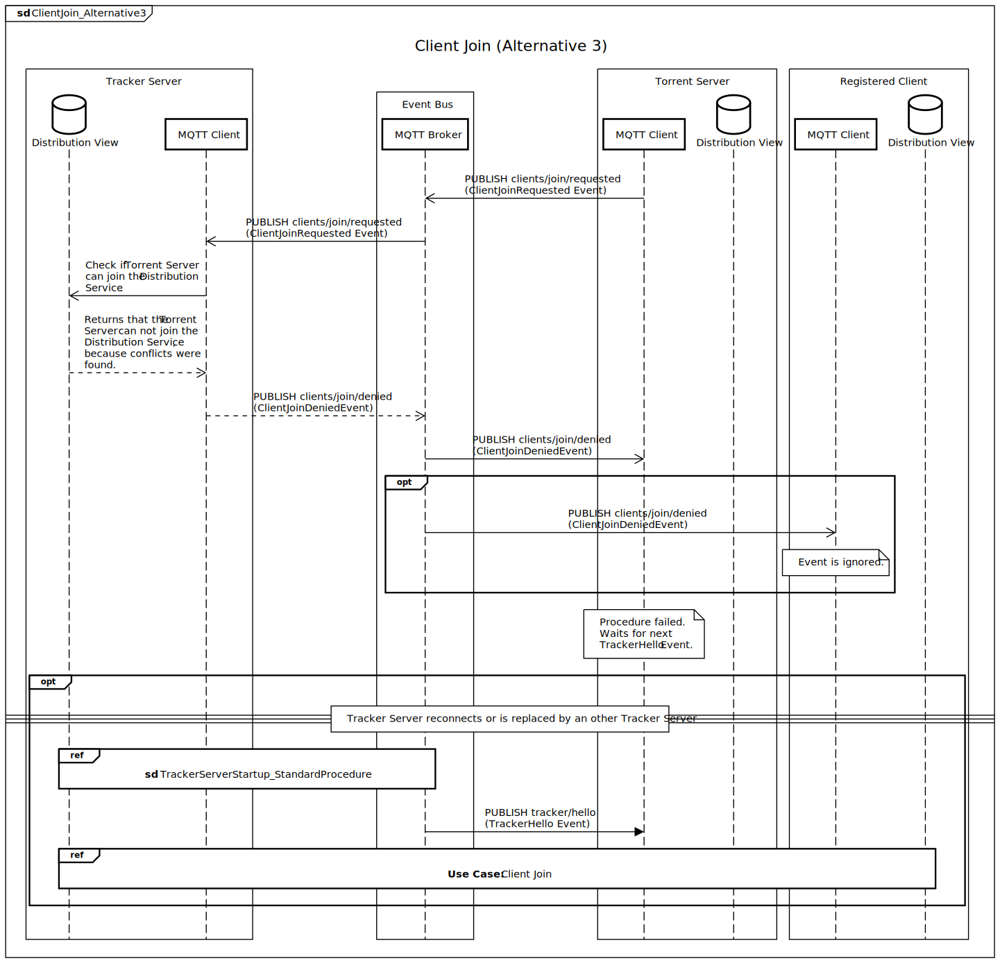

#### Alternative 4 ()
//TODO:

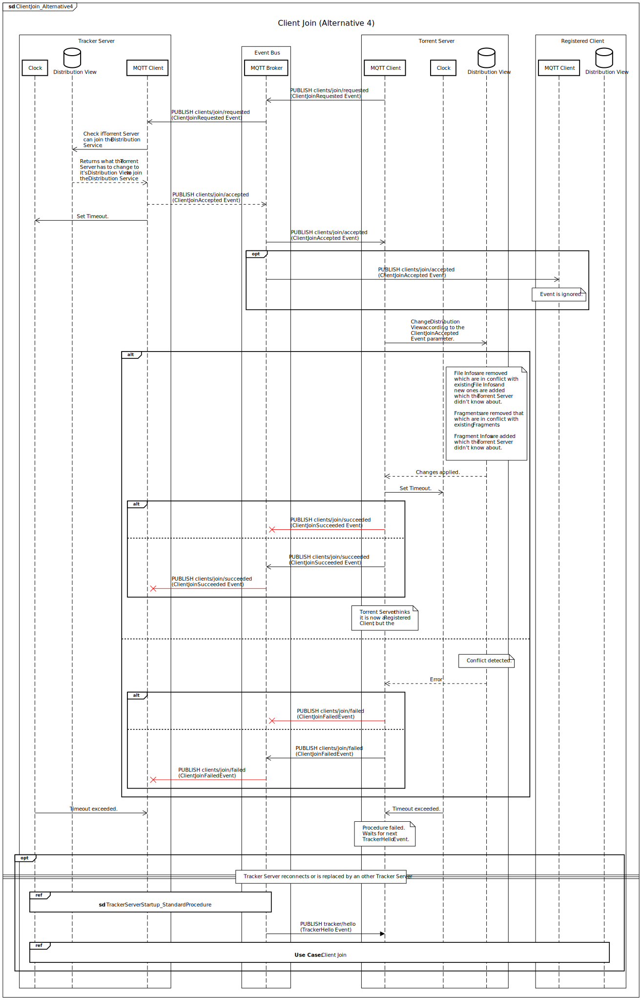

### Client Goodbye
#### Description
A *Registered Client* disconnects from the *Distribution Service*.

#### Actors
* *Tracker Server*
* *Registered Client*  
* *Event Bus* 

#### Stakeholders
* *Tracker Server*  
* *Registered Clients*

#### Preconditions
* *Tracker Server* Startup succeeded. 

#### Invariants

#### Result
* The *Registered Client* which published the *ClientGoodbye* Event is no longer a *Registered Client*. (No *Fragments* are distributed anymore to the *Registered Client*)
* The *Tracker Server* and other *Registered Clients* remove the the *Registered Client* which published the *ClientGoodbye* Event from their *Distribution View*.

#### Standard Procedure
**1.** *Registered Client* which wants to disconnect publishes the *ClientGoodbye* Event to the *Event Bus*.  
**2.** The *Event Bus* publishes the Event to the other participants.  
**3.** The *Tracker Server* and the other *Registered Clients* remove the *Registered Client* which published the *ClientGoodbye* Event from their *Distribution View*.

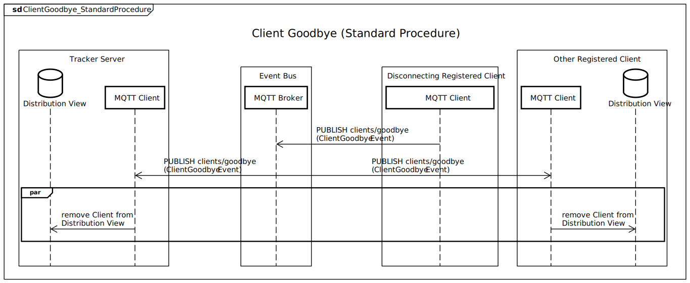

### Publish File Info
#### Description
*Tracker Server* publishes a *File Info* over the *Distribution Service* to all *Resistered Clients*. 

#### Actors
* *Tracker Server*
* *Registered Clients*  
* *Event Bus*

#### Stakeholders
* *Tracker Server*  
* *Registered Clients*

#### Preconditions
* *Tracker Server* Startup succeeded.

#### Invariants

#### Result
* All *Registered Clients* added the published *File Info* to their *Distribution View*.

#### Standard Procedure
**1.** The *Tracker Server* publishes a *FileInfoPublished* Event to the Event Bus.  
**2.** The *Event Bus* publishes the publishes *FileInfoPublished* Event to all *Registered Clients*.  
**3.** The *Registered Clients* adds the published *File Info* to their *Distribution View*.

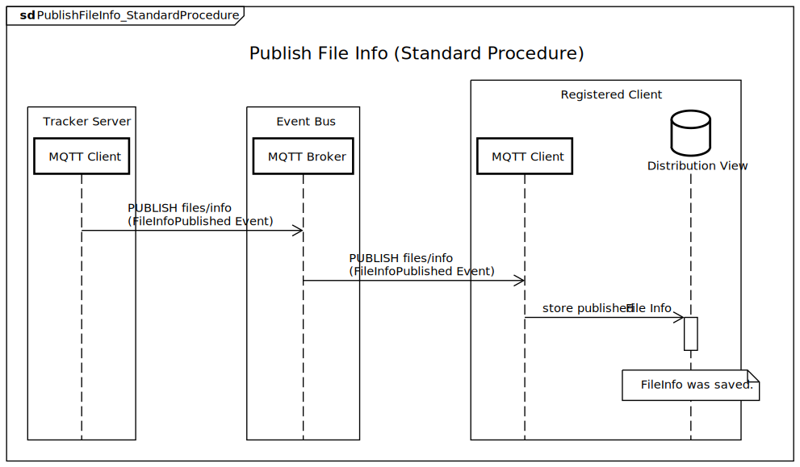

### Fragment Distribution
#### Description
The *Tracker Server* distributes a *Fragment* to some *Registered Clients*.

#### Actors
//TODO:  

#### Stakeholders
//TODO:  

#### Preconditions
//TODO:  

#### Invariants
//TODO:  

#### Result
//TODO:  

#### Standard Procedure
//TODO:  

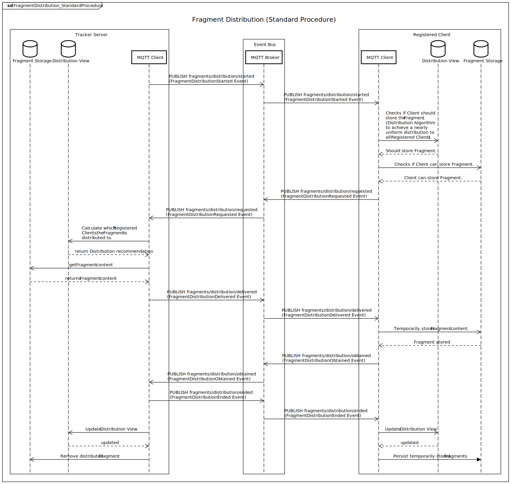

## Events
| Event                          | Issuer           | MQTT Topic                          |
|:------------------------------:|------------------|:------------------------------------|
| TrackerHello                   | *Tracker Server* | `tracker/hello`                     |
| TrackerGoodbye                 | *Tracker Server* | `tracker/goodbye`                   |
| ClientJoinRequested            | *Torrent Server* | `clients/join/requested`            |
| ClientJoinAccepted             | *Tracker Server* | `clients/join/accepted`             |
| ClientJoinDenied               | *Tracker Server* | `clients/join/denied`               |
| ClientJoinSucceeded            | *Torrent Server* | `clients/join/succeeded`            |
| ClientJoinFailed               | *Torrent Server* | `clients/join/failed`               |
| ClientRegistered               | *Tracker Server* | `clients/registered`                |
| ClientGoodbye                  | *Torrent Server* | `clients/goodbye`                   |
| FileInfoPublished              | *Tracker Server* | `files/info`                        |
| FragmentDistributionStarted    | *Tracker Server* | `fragments/distribution/started`    |
| FragmentDistributionRequested  | *Torrent Server* | `fragments/distribution/requested`  |
| FragmentDistributionDelivered  | *Tracker Server* | `fragments/distribution/delivered`  |
| FragmentDistributionObtained   | *Torrent Server* | `fragments/distribution/obtained`   |
| FragmentDistributionFailed     | *Torrent Server* | `fragments/distribution/failed`     |
| FragmentDistributionEnded      | *Tracker Server* | `fragments/distribution/ended`      |

### TrackerHello
**Description**  
This Event is triggered when the *Tracker Server* is connected to the *MQTT Broker* and is ready to respond to requests.

**Issuer**  
*Tracker Server*

**Stakeholder**  
*Torrent Server*

**MQTT Topic**  
`tracker/hello`

**Parameters**  
| Parameter Name | Data Type | Optional | Default Value |  Description |
|:---:|:---:|:---:|:---:|:---:|
| EventId | [GUID](https://docs.microsoft.com/en-us/dotnet/api/system.guid?view=netstandard-2.1) | No | *N/A* | Unique Identifier of the Event. Can be used to avoid processing of duplicates or in logging for monitoring and/or debugging.  |

### TrackerGoodbye
**Description**  
This Event is triggered when the *Tracker Server* wants to disconnect from the *MQTT Broker* and can no longer respond to requests.

**Issuer**  
*Tracker Server*

**Stakeholder**  
*Torrent Server*

**MQTT Topic**  
`tracker/goodbye`

**Parameters**  
| Parameter Name | Data Type | Optional | Default Value |  Description |
|:---:|:---:|:---:|:---:|:---:|
| EventId | [GUID](https://docs.microsoft.com/en-us/dotnet/api/system.guid?view=netstandard-2.1) | No | *N/A* | Unique Identifier of the Event. Can be used to avoid processing of duplicates or in logging for monitoring and/or debugging.  |

### ClientJoinRequested
**Description**  
This Event is triggered when an not *Registered Client* requests the *Tracker Server* to join the *Distribution Service*.

**Issuer**  
*Torrent Server*

**Stakeholder**  
*Tracker Server*

**MQTT Topic**  
`clients/join/requested`

**Parameters**  
| Parameter Name | Data Type | Optional | Default Value |  Description |
|:--------------:|:---------:|:--------:|:-------------:|:------------:|
| EventId | [GUID](https://docs.microsoft.com/en-us/dotnet/api/system.guid?view=netstandard-2.1) | No | *N/A* | Unique Identifier of the Event. Can be used to avoid processing of duplicates or in logging for monitoring and/or debugging.  |
| HashAlgorithm | [String](https://docs.microsoft.com/en-us/dotnet/api/system.string?view=netstandard-2.1) | No | *N/A* | Name of the hashing algorithm the *Torrent Server* uses. |
| FragmentSize | [Int64](https://docs.microsoft.com/en-us/dotnet/api/system.int64?view=netstandard-2.1) | Yes | [null](https://docs.microsoft.com/en-us/dotnet/csharp/language-reference/keywords/null) | The maximum fragment size used by the *Torrent Server*. All *Fragments* have to be of this size, except the last *Fragment* of a file which is allowed to be smaller, but not larger or zero. If the *Torrent Server* is not restricted to a specific fragment size, because e.g. the *Torrent Server* started from a fresh installation and stores no previous acquired data; this field can be kept empty. The fragment size used by the *Distribution Service* will be contained in the *ClientJoinAccepted* Event.  |
| KnownFileInfos | [IDictionary](https://docs.microsoft.com/en-us/dotnet/api/system.collections.generic.idictionary-2?view=netstandard-2.1)<[String](https://docs.microsoft.com/en-us/dotnet/api/system.string?view=netstandard-2.1), FileMetadata> | No | *N/A* | *File Infos* the *Torrent Server* knows about. |
| StoredFragments | [IDictionary](https://docs.microsoft.com/en-us/dotnet/api/system.collections.generic.idictionary-2?view=netstandard-2.1)<[String](https://docs.microsoft.com/en-us/dotnet/api/system.string?view=netstandard-2.1), FragmentMetadata> | No | *N/A* | Metadata about *Fragments* the *Torrent Server* stores. |
| Endpoints| [ISet](https://docs.microsoft.com/en-us/dotnet/api/system.collections.generic.iset-1?view=netstandard-2.1)<[Uri](https://docs.microsoft.com/en-us/dotnet/api/system.uri?view=netstandard-2.1)> | No | *N/A* | Set of [*Uris*](https://en.wikipedia.org/wiki/Uniform_Resource_Identifier) of the *Endpoints* the client provides. |

### ClientJoinAccepted
**Description**  
This Event is triggered when the *Tracker Server* accepts the *ClientJoinRequested* of a *Torrent Server*.

**Issuer**  
*Tracker Server*

**Stakeholder**  
*Torrent Server*

**MQTT Topic**  
`clients/join/accepted`

**Parameters**  
| Parameter Name | Data Type | Optional | Default Value |  Description |
|:--------------:|:---------:|:--------:|:-------------:|:------------:|
| EventId | [GUID](https://docs.microsoft.com/en-us/dotnet/api/system.guid?view=netstandard-2.1) | No | *N/A* | Unique Identifier of the Event. Can be used to avoid processing of duplicates or in logging for monitoring and/or debugging.  |
| ClientIdentifier| [String](https://docs.microsoft.com/en-us/dotnet/api/system.string?view=netstandard-2.1) | No | *N/A* | Identifier of the *MQTT Client* of the *Torrent Server* which was accepted to join the *Distribution Service*.   |
| FragmentSize | [Int64](https://docs.microsoft.com/en-us/dotnet/api/system.int64?view=netstandard-2.1) | No | *N/A* | The maximum fragment size used by the *Distribution Service*. All *Fragments* have to be of this size, except the last *Fragment* of a file which is allowed to be smaller, but not larger or zero. |
| AddFileInfos | [IDictionary](https://docs.microsoft.com/en-us/dotnet/api/system.collections.generic.idictionary-2?view=netstandard-2.1)<[String](https://docs.microsoft.com/en-us/dotnet/api/system.string?view=netstandard-2.1), FileMetadata> | No | *N/A* | *File Infos* the *Torrent Server* should add to it's *Distribution View*, because the *Torrent Server* did't know about them. |
| AddFragmentInfos | [IDictionary](https://docs.microsoft.com/en-us/dotnet/api/system.collections.generic.idictionary-2?view=netstandard-2.1)<[String](https://docs.microsoft.com/en-us/dotnet/api/system.string?view=netstandard-2.1), FragmentMetadata> | No | *N/A* | Metadata about *Fragments* the *Torrent Server* should add to it's *Distribution View*, because the *Torrent Server* did't know about them. |
| RemoveFileInfos| [ISet](https://docs.microsoft.com/en-us/dotnet/api/system.collections.generic.iset-1?view=netstandard-2.1)<[String](https://docs.microsoft.com/en-us/dotnet/api/system.string?view=netstandard-2.1)> | No | *N/A* | *File Infos* the *Torrent Server* should remove from it's the *Distribution View*, because they are in conflict with existing data of the *Distribution Service*. |
| RemoveFragmentInfos| [ISet](https://docs.microsoft.com/en-us/dotnet/api/system.collections.generic.iset-1?view=netstandard-2.1)<[String](https://docs.microsoft.com/en-us/dotnet/api/system.string?view=netstandard-2.1)> | No | *N/A* | *Fragments* the *Torrent Server* should delete and remove from it's *Distribution View*, because they are in conflict with existing data of the *Distribution Service*. |
| Clients| [IDictionary](https://docs.microsoft.com/en-us/dotnet/api/system.collections.generic.idictionary-2?view=netstandard-2.1)<[String](https://docs.microsoft.com/en-us/dotnet/api/system.string?view=netstandard-2.1), ClientMetadata> | No | *N/A* | Metadata about already *Registered Clients* the *Torrent Server* should add to it's *Distribution View*. |

### ClientJoinDenied
**Description**  
This Event is triggered when the *Tracker Server* denies the *ClientJoinRequested* of a *Torrent Server*.

For Example:
* `HashAlgorithm` of the *Torrent Server* does not match the `HashAlgorithm` used by the *Distribution Service*.
* `FragmentSize` of the *Torrent Server* does not match the `FragmentSize` used by the *Distribution Service*.
* The Endpoints provided by the *Torrent Server* in it's *ClientJoinRequested* overlap with already known *Endpoints*.

**Issuer**  
*Tracker Server*

**Stakeholder**  
*Torrent Server*

**MQTT Topic**  
`clients/join/denied`

**Parameters**  
| Parameter Name | Data Type | Optional | Default Value |  Description |
|:---:|:---:|:---:|:---:|:---:|
| EventId | [GUID](https://docs.microsoft.com/en-us/dotnet/api/system.guid?view=netstandard-2.1) | No | *N/A* | Unique Identifier of the Event. Can be used to avoid processing of duplicates or in logging for monitoring and/or debugging.  |
| ClientIdentifier| [String](https://docs.microsoft.com/en-us/dotnet/api/system.string?view=netstandard-2.1) | No | *N/A* | Identifier of the *MQTT Client* of the *Torrent Server* which was denied to join the *Distribution Service*.   |
| ReasonCode| ClientJoinDeniedCode | No | *N/A* | Value that categorizes why the *Torrent Server* is not allowed to join the *Distribution Service*.  |
| Reason | [String](https://docs.microsoft.com/en-us/dotnet/api/system.string?view=netstandard-2.1) | Yes | [null](https://docs.microsoft.com/en-us/dotnet/csharp/language-reference/keywords/null) | Message that contains details why the *Torrent Server* is not allowed to join the *Distribution Service*. |

### ClientJoinSucceeded
**Description**  
This Event is triggered when the *Tracker Server* successfully finished to execute the changes to the *Distribution View* described by the *ClientJoinAccepted* Event.

**Issuer**  
*Torrent Server*

**Stakeholder**  
*Tracker Server*

**MQTT Topic**  
`clients/join/succeeded`

**Parameters**  
| Parameter Name | Data Type | Optional | Default Value |  Description |
|:---:|:---:|:---:|:---:|:---:|
| EventId | [GUID](https://docs.microsoft.com/en-us/dotnet/api/system.guid?view=netstandard-2.1) | No | *N/A* | Unique Identifier of the Event. Can be used to avoid processing of duplicates or in logging for monitoring and/or debugging.  |

### ClientJoinFailed
**Description**  
This Event is triggered when the *Tracker Server* is trying to join the *Distribution Service*, but has to abort the join process because something failed. For example: failed to execute the changes to the *Distribution View* described by the *ClientJoinAccepted* Event.

**Issuer**  
*Torrent Server*

**Stakeholder**  
*Tracker Server*

**MQTT Topic**  
`clients/join/failed`

**Parameters**  
| Parameter Name | Data Type | Optional | Default Value |  Description |
|:---:|:---:|:---:|:---:|:---:|
| EventId | [GUID](https://docs.microsoft.com/en-us/dotnet/api/system.guid?view=netstandard-2.1) | No | *N/A* | Unique Identifier of the Event. Can be used to avoid processing of duplicates or in logging for monitoring and/or debugging.  |

###  ClientRegistered
**Description**  
This Event is triggered when the *Tracker Server* sets the *Torrent Server* as registered, so that the already *Registered Clients* update their *Distribution View*. *Fragments* may now be distributed to the newly *Registered Client*.

**Issuer**  
*Tracker Server*

**Stakeholder**  
*Torrent Server*

**MQTT Topic**  
`clients/registered`

**Parameters**  
| Parameter Name | Data Type | Optional | Default Value |  Description |
|:---:|:---:|:---:|:---:|:---:|
| EventId | [GUID](https://docs.microsoft.com/en-us/dotnet/api/system.guid?view=netstandard-2.1) | No | *N/A* | Unique Identifier of the Event. Can be used to avoid processing of duplicates or in logging for monitoring and/or debugging.  |
| ClientIdentifier | [String](https://docs.microsoft.com/en-us/dotnet/api/system.string?view=netstandard-2.1) | No | *N/A* | Identifier of the *MQTT Client* of the *Torrent Server* which is now a *Registered Client* of the *Distribution Service*. |
| Info | ClientAttributes | No | *N/A* | Metadata about the newly *Registered Client* for the already *Registered Clients* to update their *Distribution View*. |
| AddedFiles | [IDictionary](https://docs.microsoft.com/en-us/dotnet/api/system.collections.generic.idictionary-2?view=netstandard-2.1)<[String](https://docs.microsoft.com/en-us/dotnet/api/system.string?view=netstandard-2.1), FileMetadata>| No | *N/A* | *File Infos* that were added by the newly *Registered Client* to the *Distribution Service* for the already *Registered Clients* to update their *Distribution View*. |
| AddedFragments | [IDictionary](https://docs.microsoft.com/en-us/dotnet/api/system.collections.generic.idictionary-2?view=netstandard-2.1)<[String](https://docs.microsoft.com/en-us/dotnet/api/system.string?view=netstandard-2.1), FragmentMetadata>| No | *N/A* | *File Infos* that were added by the newly *Registered Client* to the *Distribution Service* for the already *Registered Clients* to update their *Distribution View*. |

### ClientGoodbye
**Description**  
This Event is triggered when the *Torrent Server* wants to disconnect from the *MQTT Broker* and can no longer respond to requests.

**Issuer**  
*Torrent Server*

**Stakeholder**  
*Tracker Server*  
*Torrent Server*

**MQTT Topic**  
`clients/goodbye`

**Parameters**  
| Parameter Name | Data Type | Optional | Default Value |  Description |
|:---:|:---:|:---:|:---:|:---:|
| EventId | [GUID](https://docs.microsoft.com/en-us/dotnet/api/system.guid?view=netstandard-2.1) | No | *N/A* | Unique Identifier of the Event. Can be used to avoid processing of duplicates or in logging for monitoring and/or debugging.  |

### FileInfoPublished
**Description**  
This Event is triggered when the *Tracker Server* publishes information about an fragmented file (*File Info*).
The published information is stored by the *Torrent Server* to refresh it's *Distribution View*.

**Issuer**  
*Tracker Server*

**Stakeholder**  
*Torrent Server*

**MQTT Topic**  
`files/info`

**Parameters**  
| Parameter Name | Data Type | Optional | Default Value |  Description |
|:---:|:---:|:---:|:---:|:---:|
| EventId | [GUID](https://docs.microsoft.com/en-us/dotnet/api/system.guid?view=netstandard-2.1) | No | *N/A* | Unique Identifier of the Event. Can be used to avoid processing of duplicates or in logging for monitoring and/or debugging.  |
| Hash| [String](https://docs.microsoft.com/en-us/dotnet/api/system.string?view=netstandard-2.1) | No | *N/A* | Hash value of the entire file content.  |
| Size| [Int64](https://docs.microsoft.com/en-us/dotnet/api/system.int64?view=netstandard-2.1) | No | *N/A* | Length of the entire file content in [Bytes](https://docs.microsoft.com/en-us/dotnet/api/system.byte?view=netstandard-2.1).  |
| FragmentSequence| [IEnumerable](https://docs.microsoft.com/en-us/dotnet/api/system.collections.generic.ienumerable-1?view=netstandard-2.1)<[String](https://docs.microsoft.com/en-us/dotnet/api/system.string?view=netstandard-2.1)> | No | *N/A* | Sequence of hash values of the fragments the file consists of.  |

### FragmentDistributionStarted
**Description**  
This Event is triggered when the *Tracker Server* starts the distribution of a *Fragment*. *Registered Clients* can now request (*FragmentDistributionRequested* Event) to get the *Fragment*.

**Issuer**  
*Tracker Server*

**Stakeholder**  
*Torrent Server*

**MQTT Topic**  
`fragments/distribution/started`

**Parameters**  
| Parameter Name | Data Type | Optional | Default Value |  Description |
|:---:|:---:|:---:|:---:|:---:|
| EventId | [GUID](https://docs.microsoft.com/en-us/dotnet/api/system.guid?view=netstandard-2.1) | No | *N/A* | Unique Identifier of the Event. Can be used to avoid processing of duplicates or in logging for monitoring and/or debugging.  |
| Hash| [String](https://docs.microsoft.com/en-us/dotnet/api/system.string?view=netstandard-2.1) | No | *N/A* | Hash value of the *Fragment* that should be distributed.  |
| Size| [Int64](https://docs.microsoft.com/en-us/dotnet/api/system.int64?view=netstandard-2.1) | No | *N/A* | Length of the *Fragment* content in [Bytes](https://docs.microsoft.com/en-us/dotnet/api/system.byte?view=netstandard-2.1).  |

### FragmentDistributionRequested
**Description**  
This Event is triggered when a *Registered Client* requests to get a *Fragment* delivered (*FragmentDistributionDelivered* Event).

**Issuer**  
*Torrent Server*

**Stakeholder**  
*Tracker Server*

**MQTT Topic**  
`fragments/distribution/requested`

**Parameters**  
| Parameter Name | Data Type | Optional | Default Value |  Description |
|:---:|:---:|:---:|:---:|:---:|
| EventId | [GUID](https://docs.microsoft.com/en-us/dotnet/api/system.guid?view=netstandard-2.1) | No | *N/A* | Unique Identifier of the Event. Can be used to avoid processing of duplicates or in logging for monitoring and/or debugging.  |
| Hash| [String](https://docs.microsoft.com/en-us/dotnet/api/system.string?view=netstandard-2.1) | No | *N/A* | Hash value of the *Fragment* that should be delivered to the requesting client.  |

### FragmentDistributionDelivered
**Description**  
This Event is triggered when the *Tracker Server* distributes the content of the *Fragment* to the *Registered Clients* that requested it.

**Issuer**  
*Tracker Server*

**Stakeholder**  
*Torrent Server*

**MQTT Topic**  
`fragments/distribution/delivered`

**Parameters**  
| Parameter Name | Data Type | Optional | Default Value |  Description |
|:---:|:---:|:---:|:---:|:---:|
| EventId | [GUID](https://docs.microsoft.com/en-us/dotnet/api/system.guid?view=netstandard-2.1) | No | *N/A* | Unique Identifier of the Event. Can be used to avoid processing of duplicates or in logging for monitoring and/or debugging.  |
| Hash| [String](https://docs.microsoft.com/en-us/dotnet/api/system.string?view=netstandard-2.1) | No | *N/A* | Hash value of the *Fragment* that is delivered.  |
| Data| [byte](https://docs.microsoft.com/en-us/dotnet/api/system.byte?view=netstandard-2.1)[] | No | *N/A* | Content of the *Fragment*.  |
| Receivers| [ISet](https://docs.microsoft.com/en-us/dotnet/api/system.collections.generic.iset-1?view=netstandard-2.1)<[String](https://docs.microsoft.com/en-us/dotnet/api/system.string?view=netstandard-2.1)> | No | *N/A* | Identifiers of the *MQTT Clients* of the *Registered Clients* that should store the *Fragment*.

### FragmentDistributionObtained
**Description**  
This Event is triggered when a *Registered Client* confirms that it obtained the distributed *Fragment*.

**Issuer**  
*Torrent Server*

**Stakeholder**  
*Tracker Server*

**MQTT Topic**  
`fragments/distribution/obtained`

**Parameters**  
| Parameter Name | Data Type | Optional | Default Value |  Description |
|:---:|:---:|:---:|:---:|:---:|
| EventId | [GUID](https://docs.microsoft.com/en-us/dotnet/api/system.guid?view=netstandard-2.1) | No | *N/A* | Unique Identifier of the Event. Can be used to avoid processing of duplicates or in logging for monitoring and/or debugging.  |
| Hash| [String](https://docs.microsoft.com/en-us/dotnet/api/system.string?view=netstandard-2.1) | No | *N/A* | Hash value of the distributed *Fragment* that that was obtained by the calling client.  |

### FragmentDistributionFailed
**Description**  
This Event is triggered when a *Registered Client* informs that the *Fragment* distribution failed.

**Issuer**  
*Torrent Server*

**Stakeholder**  
*Tracker Server*

**MQTT Topic**  
`fragments/distribution/failed`

**Parameters**  
| Parameter Name | Data Type | Optional | Default Value |  Description |
|:---:|:---:|:---:|:---:|:---:|
| EventId | [GUID](https://docs.microsoft.com/en-us/dotnet/api/system.guid?view=netstandard-2.1) | No | *N/A* | Unique Identifier of the Event. Can be used to avoid processing of duplicates or in logging for monitoring and/or debugging.  |
| Hash| [String](https://docs.microsoft.com/en-us/dotnet/api/system.string?view=netstandard-2.1) | No | *N/A* | Hash value of the *Fragment* whose distribution failed for the calling client.  |

### FragmentDistributionEnded
**Description**  
This Event is triggered when the *Tracker Server* informs all *Registered Clients* how the Distribution ended to update their *Distribution View*.

**Issuer**  
*Tracker Server*

**Stakeholder**  
*Torrent Server*

**MQTT Topic**  
`fragments/distribution/ended`

**Parameters**  
| Parameter Name | Data Type | Optional | Default Value |  Description |
|:---:|:---:|:---:|:---:|:---:|
| EventId | [GUID](https://docs.microsoft.com/en-us/dotnet/api/system.guid?view=netstandard-2.1) | No | *N/A* | Unique Identifier of the Event. Can be used to avoid processing of duplicates or in logging for monitoring and/or debugging.  |
| Hash| [String](https://docs.microsoft.com/en-us/dotnet/api/system.string?view=netstandard-2.1) | No | *N/A* | Hash value of the *Fragment* that was delivered.  |
| Size| [Int64](https://docs.microsoft.com/en-us/dotnet/api/system.int64?view=netstandard-2.1) | No | *N/A* | Length of the *Fragment* content in [Bytes](https://docs.microsoft.com/en-us/dotnet/api/system.byte?view=netstandard-2.1).  |
| Receivers| [ISet](https://docs.microsoft.com/en-us/dotnet/api/system.collections.generic.iset-1?view=netstandard-2.1)<[String](https://docs.microsoft.com/en-us/dotnet/api/system.string?view=netstandard-2.1)> | No | *N/A* | Identifiers of the *MQTT Clients* of the *Registered Clients* that received the *Fragment* successfully.

## Custom Data Types

### ClientJoinDeniedCode (Enumeration)

| Name | Value | Description|
|:---:|:---:|:---:|
| WrongFragmentSize |  1  | `FragmentSize` of the *Torrent Server* does not match the `FragmentSize` used by the *Distribution Service*. |
| WrongHashAlgorithm |  2  | `HashAlgorithm` of the *Torrent Server* does not match the `HashAlgorithm` used by the *Distribution Service*. |
| EndpointConflict |  4  | The Endpoints provided by the *Torrent Server* in it's *ClientJoinRequested* overlap with already known *Endpoints*. |
| Other | 128 | The *ClientJoinRequested* was denied byte the *Tracker Server* for other reasons. (Look at the `Reason` parameter for details.) |

### ClientMetadata (Object)

| Attribute | Data Type | Optional | Default Value | Description |
|:---------:|:---------:|:--------:|:-------------:|:-----------:|
| Endpoints | [ISet](https://docs.microsoft.com/en-us/dotnet/api/system.collections.generic.iset-1?view=netstandard-2.1)<[Uri](https://docs.microsoft.com/en-us/dotnet/api/system.uri?view=netstandard-2.1)> | No | *N/A* | Set of [*Uris*](https://en.wikipedia.org/wiki/Uniform_Resource_Identifier) of the *Endpoints* the client provides. |
| StoredFragments| [ISet](https://docs.microsoft.com/en-us/dotnet/api/system.collections.generic.iset-1?view=netstandard-2.1)<[String](https://docs.microsoft.com/en-us/dotnet/api/system.string?view=netstandard-2.1)> | No | *N/A* | Set of hash values of the *Fragments* the client stores.  |

### FileMetadata (Object)

| Attribute | Data Type | Optional | Default Value | Description |
|:---------:|:---------:|:--------:|:-------------:|:-----------:|
| Size| [Int64](https://docs.microsoft.com/en-us/dotnet/api/system.int64?view=netstandard-2.1) | No | *N/A* | Length of the entire file content in [Bytes](https://docs.microsoft.com/en-us/dotnet/api/system.byte?view=netstandard-2.1).  |
| FragmentSequence| [IEnumerable](https://docs.microsoft.com/en-us/dotnet/api/system.collections.generic.ienumerable-1?view=netstandard-2.1)<[String](https://docs.microsoft.com/en-us/dotnet/api/system.string?view=netstandard-2.1)> | No | *N/A* | Sequence of hash values of the fragments the file consists of.  |

### FragmentMetadata (Object)

| Attribute | Data Type | Optional | Default Value | Description |
|:---------:|:---------:|:--------:|:-------------:|:-----------:|
| Size| [Int64](https://docs.microsoft.com/en-us/dotnet/api/system.int64?view=netstandard-2.1) | No | *N/A* | Length of the *Fragment* content in [Bytes](https://docs.microsoft.com/en-us/dotnet/api/system.byte?view=netstandard-2.1).  |

## About

The UML Sequence Diagrams are created with [SequenceDiagram.org](https://sequencediagram.org).